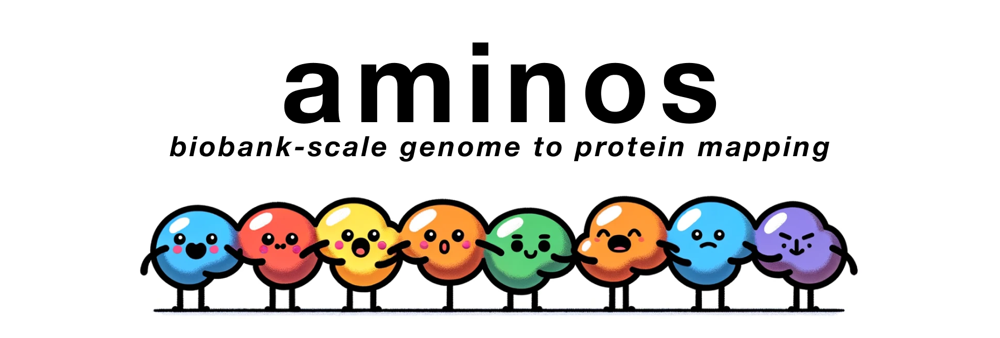

<p align="center">
  
</p>

## Overview

Convert large genetic VCF files into FASTA files corresponding to individual's protein sequences. This repo will handle complex combinations of coding variants scaling to biobank-size genetic sequencing datasets.

## Install

```
git clone https://github.com/barneyhill/aminos
cd aminos
pip install -r requirements.txt
```

## Usage
```
python3 aminos.py --vcf [path-to-vcf] --gff [path-to-gff] --fasta [path-to-fasta] --output [output-directory]
```

## Initially supported consequences

- missense
- inframe_deletion
- inframe_insertion